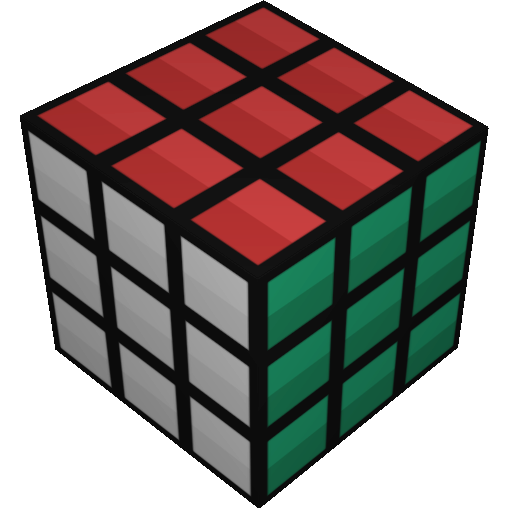
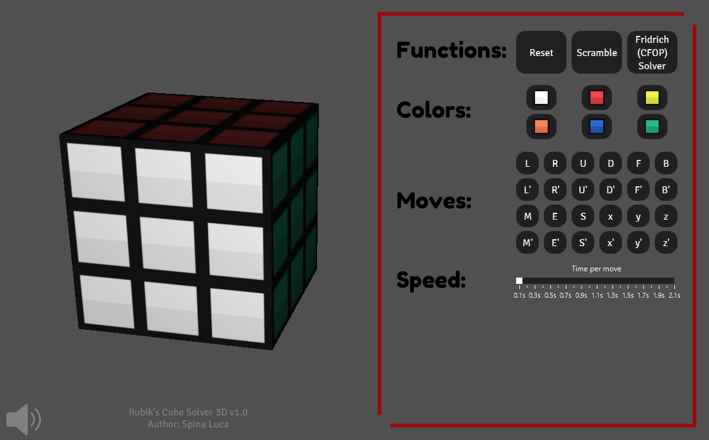

# Rubik's Cube Solver 3D

_Latest release is 1.0.  This file last updated on 06 April 2025._

## Brief Description ##

**Rubik's Cube Solver 3D** is a modern graphical application designed for intuitive and interactive manipulation of a Rubik’s Cube in a fully 3D environment. The software provides users with a seamless and visually engaging interface to explore, understand, and experiment with the cube’s mechanics—whether for casual play, speedcubing practice, or educational purposes.

At its core, Rubik’s Cube Solver 3D allows you to rotate and inspect the cube freely from any angle, giving you complete spatial awareness of the current state. You can perform individual face turns, scramble the cube with random sequences, or watch it solve itself step-by-step. Each move is accompanied by a clear visual indicator and a textual description, making it especially useful for beginners learning notation or advanced users studying algorithms.

The software supports full customization: users can modify the color of each cubelet to match real-life puzzles or personal preferences, and can also control the speed of animations to suit different levels of focus or demonstration needs. Whether you’re looking to visualize a specific algorithm, follow along with a tutorial, or simply enjoy the aesthetics of a rotating cube, Rubik's Cube Solver 3D provides a powerful yet approachable toolset.

## Screenshots ##

## License ##

GNU General Public License, version 2 or later.
